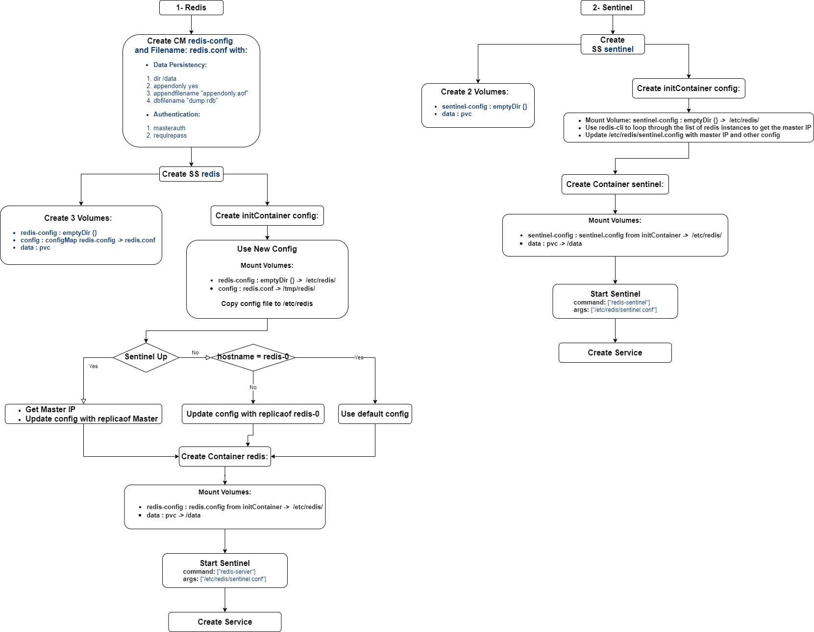

# Redis Technical Details
what is redis  
Persistence  
Authentication  
Replication  
Clustering (Failover)  

# Flow Chart of the Configuration


# Configuration

**Redis Setup**
```bash
kubectl create ns redis
kubectl apply -f redis/redis-configmap.yaml
kubectl apply -f redis/redis-statefulset.yaml 
```

**Sentinel Setup**
```bash
kubectl apply -f sentinel/sentinel-statefulset.yaml
```

**Get Master's IP**  
```bash 
kubectl get pods -n redis -o wide | grep `kubectl exec redis-0 -n redis -- redis-cli -h sentinel -p 5000 sentinel get-master-addr-by-name mymaster | head -n 1` | awk '{print $1}'
```

**Client Setup**
```bash
docker build client/ -t ziadhhassan/redis-client
docker login
docker push ziadhhassan/redis-client
kubectl apply -f client/redis-client.yaml
kubectl apply -f client/redis-service.yaml
```